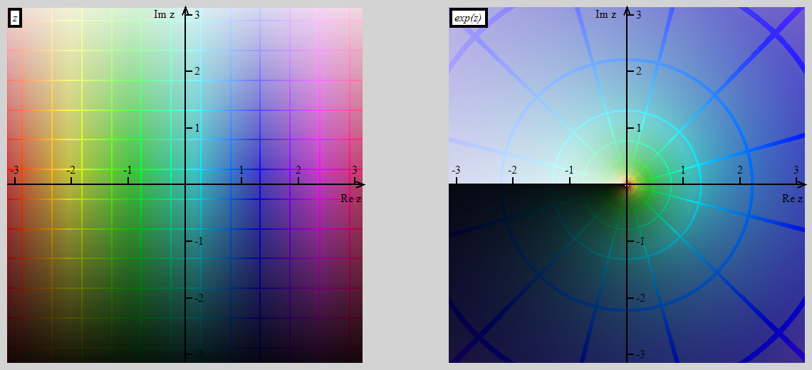

# Complex Graph

# Introduction

This is a tool that is supposed to make visualization of complex-valued
functions be easier to understand. The main idea is to show positions of
the complex plane points before and after applying the function. Such an
approach is planned to performed by filling some area in preimage complex
plane with colors of different hue and lightness (hue changes along the
real direction and lightness along the imaginary one). Then each point
in image area will be marked by the corresponding color of its preimage.
Thus one can realize how exactly the function changes the complex plane.

The project is in a work stage...

# Examples

## Square

## Square root

## Sine

## Cosine

## Exponent

## Natural logarithm

# **The author is not responsible for the mental health that can be damaged during reading this code**